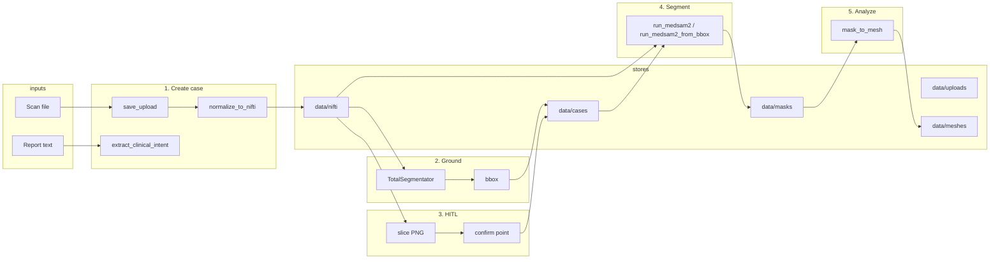

# Data Flow in the Clinical 3D Pipeline

This document describes how data moves through the system from upload to mesh/metrics.

---

## 1. High-level flow (end-to-end)

```
┌─────────────────┐     ┌─────────────────┐
│  Scan file      │     │  Report text     │
│  (ZIP/NIfTI/…)  │     │  (radiology)     │
└────────┬────────┘     └────────┬────────┘
         │                       │
         ▼                       ▼
┌─────────────────────────────────────────┐
│  POST /cases                             │
│  • save_upload_to_disk → data/uploads/   │
│  • normalize_to_nifti → data/nifti/      │
│  • extract_clinical_intent (LLM)         │
└────────┬────────────────────────────────┘
         │
         │  case_id, IngestResult, intent
         ▼
┌─────────────────────────────────────────┐
│  POST /cases/{id}/ground                │
│  • TotalSegmentator on NIfTI             │
│  • organ mask → bbox (x,y,z,w,h,d)       │
│  • set_bbox → data/cases/{id}.json       │
└────────┬────────────────────────────────┘
         │
         ▼
┌─────────────────────────────────────────┐
│  Human verification (HITL)               │
│  • GET volume_slice → PNG with bbox      │
│  • Doctor clicks → (x,y,z)               │
│  • POST confirm-point → case_store       │
└────────┬────────────────────────────────┘
         │
         ▼
┌─────────────────────────────────────────┐
│  POST /cases/{id}/segment               │
│  • Point: run_medsam2(nifti, point)      │
│  • Or bbox: run_medsam2_from_bbox(bbox)  │
│  • Output: data/masks/{id}_lesion_mask   │
└────────┬────────────────────────────────┘
         │
         ▼
┌─────────────────────────────────────────┐
│  POST /cases/{id}/analyze               │
│  • mask_to_mesh → marching cubes → STL   │
│  • data/meshes/{id}_lesion_mesh.stl      │
│  • volume_cm3, max_diameter_cm           │
└─────────────────────────────────────────┘
```

---

## 2. Data stores (where data lives)

| Store | Path / key | Contents |
|-------|------------|----------|
| Uploads | `data/uploads/{scan_id}/raw/` | Original file (ZIP, NIfTI, NRRD, image) |
| NIfTI | `data/nifti/{case_id}.nii.gz` | Normalized 3D volume (same as case_id) |
| Case state | `data/cases/{case_id}.json` | `bbox_voxel`, `confirmed_point_voxel`, `verification_status`, `grounding_status` |
| TotalSegmentator | `data/totalseg/{case_id}/*.nii.gz` | Organ masks (e.g. kidney_right.nii.gz) |
| Masks | `data/masks/{case_id}_lesion_mask.nii.gz` | 3D binary lesion mask from MedSAM2 |
| Meshes | `data/meshes/{case_id}_lesion_mesh.stl`, `…_lesion_mesh.obj` | STL for 3D printing/surgical planning; OBJ for color metadata (e.g. blood test warnings on tissue surface) |

---

## 2b. Critical: Voxel vs World and the Affine (Step 3 verification)

In medical imaging there are two coordinate systems:

- **Voxel space:** Index coordinates `(0,0,0)` to `(nz-1, ny-1, nx-1)` — the array indices of the NIfTI volume.
- **World space:** Millimeter coordinates (e.g. **RAS**: Right, Anterior, Superior) relative to the scanner, given by the **affine matrix** in the NIfTI header: `world = affine @ [i, j, k, 1]`.

**Verification check:** If the affine is ignored, the doctor might click what they see as "left kidney" in the UI, but the stored voxel could refer to a different anatomy (e.g. spleen) if the volume was stored flipped or rotated. The pipeline must use a consistent convention so that (u, v) → (x, y, z) matches what is displayed.

**What this codebase does:**

- **Display:** `get_slice_png` reads the NIfTI array and optionally applies a **radiological display** flip (so "left" on screen is patient left). The affine is read and can be exposed via `GET /cases/{id}/volume_affine`.
- **Click → voxel:** The UI (or backend) uses `pixel_to_voxel()` with the same `radiological_display` flag as used for the slice. That way the confirmed (x, y, z) are correct **voxel indices** for the same NIfTI that MedSAM2 and TotalSegmentator use.
- **Downstream:** MedSAM2 and TotalSegmentator work on the same NIfTI in voxel space; no world conversion is needed as long as the confirmed point is in the same voxel convention.

When adding new viewers or APIs, ensure display and click-to-voxel both use the same orientation (array order or radiological) and, if needed, the affine for world ↔ voxel conversion.

---

## 3. Per-step data flow

### Step 1: Create case

| Input | Code | Output |
|-------|------|--------|
| `scan_file` bytes, `modality`, `report_text` | `save_upload_to_disk` → `normalize_to_nifti` | `data/uploads/`, `data/nifti/{case_id}.nii.gz` |
| `report_text` | `extract_clinical_intent` (LLM) | `{ organ, region, finding }` |
| — | — | `case_id` (= scan_id), `IngestResult`, `intent` |

### Step 2: Ground

| Input | Code | Output |
|-------|------|--------|
| `case_id`, `organ` | `run_grounding_for_case` → TotalSegmentator | Organ mask in `data/totalseg/{case_id}/` |
| Organ mask | `_compute_bbox_from_mask` | `BoundingBox(x,y,z, width, height, depth)` |
| bbox | `set_bbox(case_id, bbox)` | `data/cases/{case_id}.json` ← `bbox_voxel` |
| — | `set_grounding_status(case_id, "processing")` at start, `"completed"` / `"failed"` when done | UI can poll verification and show a loading spinner while `grounding_status === "processing"` |

### Step 3: Human verification

| Input | Code | Output |
|-------|------|--------|
| `case_id`, `axis`, `index`, `with_bbox` | `get_slice_png(nifti_path, axis, index, bbox_voxel)` | PNG bytes (slice image, optional bbox overlay) |
| Doctor click (pixel) + axis, slice_index | UI maps (u,v) → voxel (x,y,z) via `pixel_to_voxel(…, radiological_display)` to match slice orientation | — |
| `case_id`, (x,y,z) | `set_confirmed_point(case_id, x, y, z)` | `data/cases/{case_id}.json` ← `confirmed_point_voxel`, `verification_status` |

### Step 4: Segment

| Input | Code | Output |
|-------|------|--------|
| `case_id` + body point **or** stored `confirmed_point_voxel` | `run_medsam2(case_id, (z,y,x))` | `data/masks/{case_id}_lesion_mask.nii.gz` |
| `case_id` + stored `bbox_voxel` only | `run_medsam2_from_bbox(case_id, bbox)` | Same mask path |
| Internally | NIfTI + point/bbox → MedSAM2 (or placeholder) | 3D binary mask NIfTI |

### Step 5: Analyze

| Input | Code | Output |
|-------|------|--------|
| `case_id` | `mask_to_mesh(case_id)` | Reads `data/masks/{case_id}_lesion_mask.nii.gz` |
| Mask + **voxel spacing (pixdim)** | Volume = voxel count × sx × sy × sz (mm³ → cm³) | Input to metrics |
| Mask + spacing | `marching_cubes` → trimesh → STL + OBJ | `data/meshes/{case_id}_lesion_mesh.stl` and `.obj` |
| Mesh | Volume, max diameter, **voxel_spacing_mm** | `MeshMetrics(mesh_path, mesh_path_obj, volume_cm3, max_diameter_cm, voxel_spacing_mm)` |

---

## 4. Mermaid diagram (paste into a Mermaid viewer or GitHub markdown)



---

## 5. Key code entry points

| Step | Module | Function / endpoint |
|------|--------|----------------------|
| 1 | `main.py` | `POST /cases` → `imaging.ingest`, `nlp.clinical_intent_extractor` |
| 2 | `main.py` | `POST /cases/{id}/ground` → `imaging.grounding.run_grounding_for_case`, `data.case_store.set_bbox` |
| 3 | `main.py` | `GET volume_slice` → `imaging.slices.get_slice_png`; `POST confirm-point` → `set_confirmed_point` |
| 4 | `main.py` | `POST /cases/{id}/segment` → `segmentation.medsam2_runner.run_medsam2` or `run_medsam2_from_bbox` |
| 5 | `main.py` | `POST /cases/{id}/analyze` → `analysis.mesh.mask_to_mesh` |

The **case_id** ties everything together: same ID is used for NIfTI path, case state JSON, mask path, and mesh path.

---

## 6. Visualization (STL vs OBJ)

- **STL** is used for 3D printing and surgical planning (geometry only).
- **OBJ** is exported alongside STL; use it when you need **color or metadata** on the surface (e.g. mapping blood test warnings or risk levels onto the mesh). The analyze step returns both `mesh_path` (STL) and `mesh_path_obj` (OBJ).
